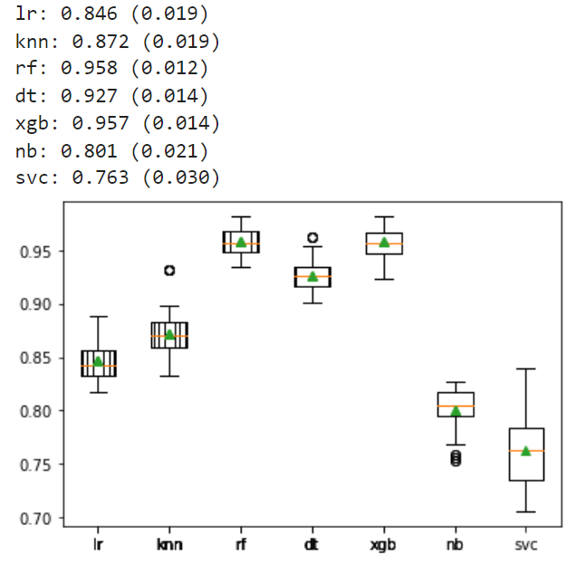

# **Malicious-URL-Detection**

#### **AIVLE School 2기 미니프로젝트 - 악성 URL 탐지 모델링**  

---

### **모델링 결과**

|Model|F1-Score|Accuracy|
|--|--|--|
|XGBoost|96.17|96.08|
|RandomForest|95.24|95.15|
|SVC|77.99|78.76|
|Decision Tree|92.32|92.16|
|Ensemble-voting|95.92|95.88|
|Ensemble-stacking|95.05|95.05|
|Bernoulli Naive Bayes|81.55|79.90|

_Cross Validation 결과_  

_리더보드 결과_  
|Model|Score|
|--|--|
|XGBoost|93.53|
|RandomForest|93.65|
|Ensemble-voting|94.02|
|Ensemble-stacking|92.71|
